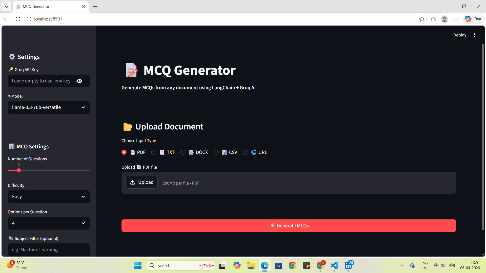
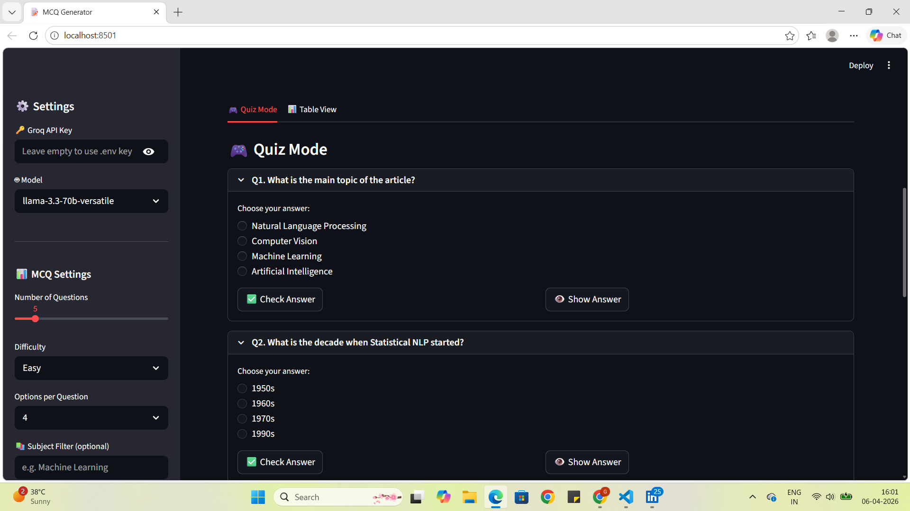
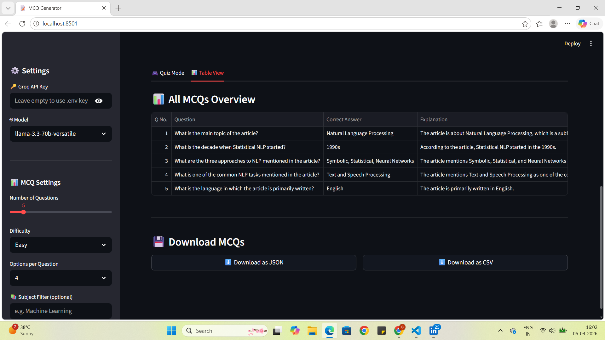

# 📝 MCQ Generator

An end-to-end Automated MCQ Generator built using **LangChain + Groq API + Streamlit**.

## 🖼️ Screenshots

### 🏠 Home Page


### 🎮 Quiz Mode


### 📊 Table View


### ⬇️ Download Section

---

## 🚀 Features
- 📂 Supports multiple file types — PDF, TXT, DOCX, CSV, and URL
- ⚙️ Control number of questions, difficulty, options per question, subject filter
- 🎮 Interactive Quiz Mode with Check/Show answer buttons
- 💡 Explanation for every correct answer
- 📊 Table View of all MCQs with answers
- ⬇️ Download MCQs as JSON
- 📋 Logging system to track all activity

---

## 🛠️ Tech Stack
- [LangChain](https://langchain.com)
- [Groq API](https://console.groq.com) (Free — LLaMA3, Mixtral)
- [Streamlit](https://streamlit.io)
- PyPDF, Docx2txt

---

---

## ⚙️ Setup & Installation

### 1. Clone the repo
```bash
git clone https://github.com/your_username/MCQGenerator.git
cd MCQGenerator
```

### 2. Create virtual environment
```bash
python -m venv venv
venv\Scripts\activate        # Windows
source venv/bin/activate     # Mac/Linux
```

### 3. Install dependencies
```bash
pip install -r requirements.txt
pip install -e .
```

### 4. Add API key in `.env`

### 5. Run the app
```bash
streamlit run StreamlitAPP.py
```

---

## 🔑 Get Free API Key
- **Groq API** → [console.groq.com](https://console.groq.com) — Free tier available

---

## 📌 Supported Input Types

| Type | Extension |
|------|-----------|
| PDF  | `.pdf`    |
| Text | `.txt`    |
| Word | `.docx`   |
| CSV  | `.csv`    |
| URL  | any link  |

---

## 🤖 Supported Models

| Model              | Context |
|------------------  |---------|
| llama3-70b-8192    | 8K      |
| mixtral-8x7b-32768 | 32K     |
| llama3-8b-8192     | 8K      |
