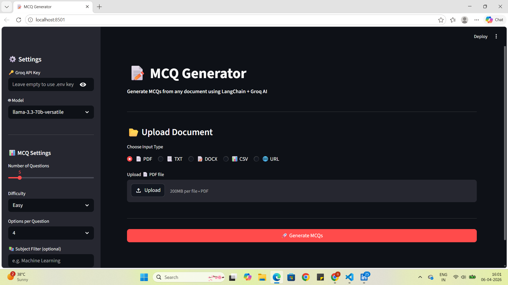
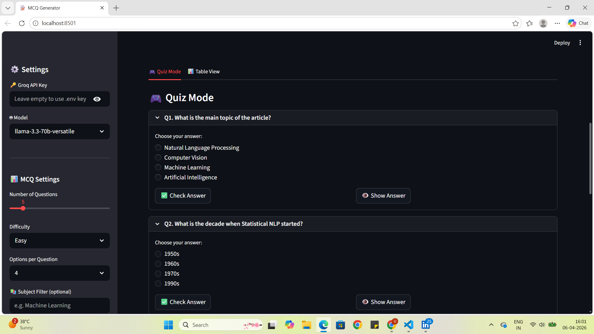
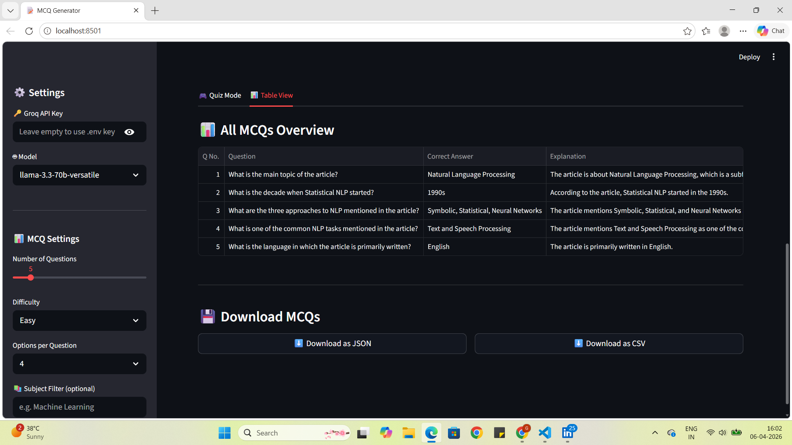
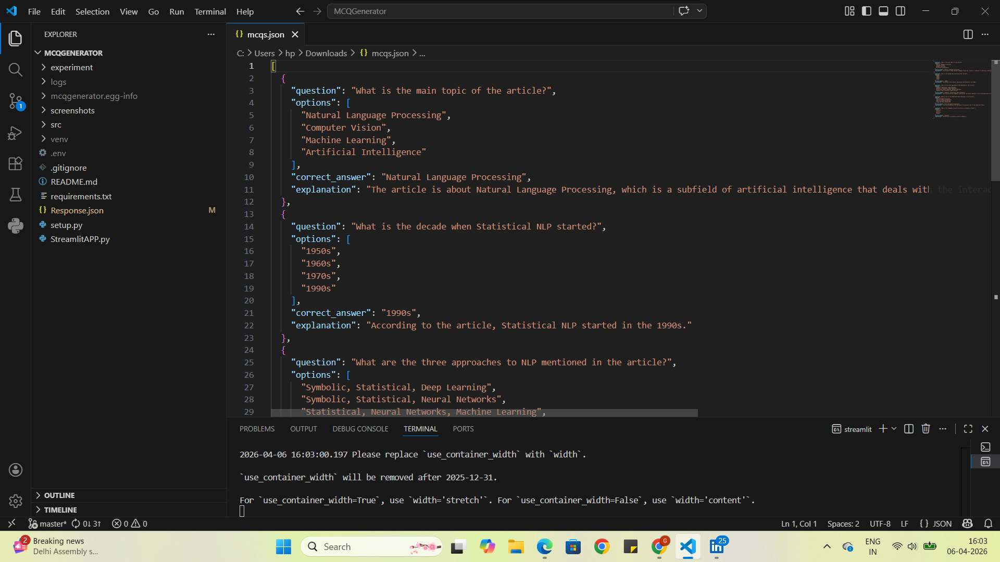
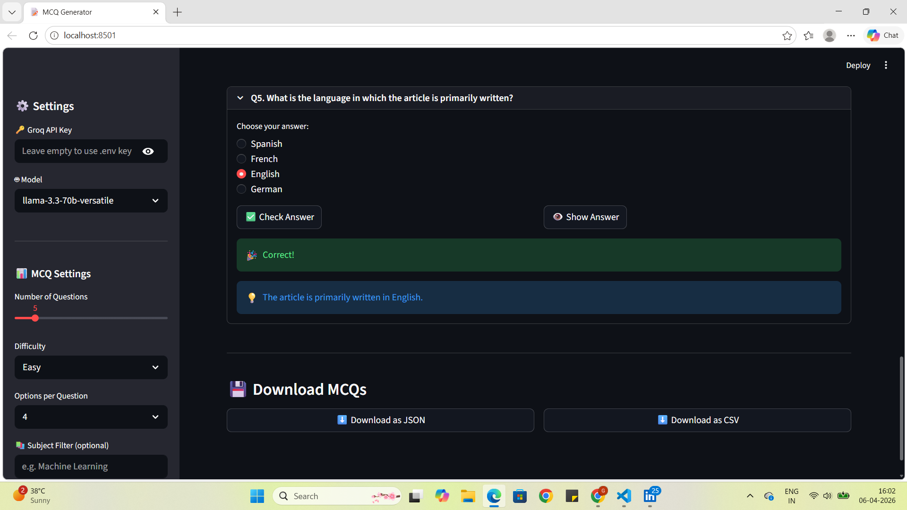

# 📝 MCQ Generator

An end-to-end Automated MCQ Generator built using **LangChain + Groq API + Streamlit**.
> 🤖 Built using **LangGraph (create_react_agent)** for modern agentic workflow — 
> migrated from deprecated AgentExecutor architecture.

## 📁 Project Structure
```
MCQGenerator/
├── src/
│   └── mcqgenerator/
│       ├── MCQGenerator.py   ← core LangChain + Groq logic
│       └── utils.py          ← file reading, table formatting
├── screenshots/              ← app screenshots
├── experiment/               ← Jupyter notebooks (experiments)
├── StreamlitAPP.py           ← main Streamlit UI
├── requirements.txt
├── setup.py
└── .env                      ← API key (not committed)
```
## 🧠 How It Works

1. **Input** — User uploads PDF/TXT/DOCX/CSV or pastes a URL
2. **Text Extraction** — File is read using PyPDF / Docx2txt / BeautifulSoup
3. **LangGraph Agent** — `create_react_agent` orchestrates the generation workflow
4. **Prompt Engineering** — Custom prompt sent to Groq LLM (LLaMA 3.3 70B)
5. **JSON Parsing** — Output parsed into structured MCQ format
6. **Streamlit UI** — Quiz mode, table view, and download rendered live

## 🖼️ Screenshots

### 🏠 Home Page


### 🎮 Quiz Mode


### 📊 Table View


### ⬇️ Download Section


### testing section

---

## 🚀 Features
- 📂 Supports multiple file types — PDF, TXT, DOCX, CSV, and URL
- ⚙️ Control number of questions, difficulty, options per question, subject filter
- 🎮 Interactive Quiz Mode with Check/Show answer buttons
- 💡 Explanation for every correct answer
- 📊 Table View of all MCQs with answers
- ⬇️ Download MCQs as JSON
- 📋 Logging system to track all activity

---

## 🛠️ Tech Stack
- [LangChain](https://langchain.com)
- [LangGraph](https://langchain-ai.github.io/langgraph/) — `create_react_agent` for agentic workflow (migrated from AgentExecutor)
- [Groq API](https://console.groq.com) (Free — LLaMA3, Mixtral)
- [Streamlit](https://streamlit.io)
- PyPDF, Docx2txt

---

---

## ⚙️ Setup & Installation

### 1. Clone the repo
```bash
git clone https://github.com/your_username/MCQGenerator.git
cd MCQGenerator
```

### 2. Create virtual environment
```bash
python -m venv venv
venv\Scripts\activate        # Windows
source venv/bin/activate     # Mac/Linux
```

### 3. Install dependencies
```bash
pip install -r requirements.txt
pip install -e .
```

### 4. Add API key in `.env`

### 5. Run the app
```bash
streamlit run StreamlitAPP.py
```

---

## 🔑 Get Free API Key
- **Groq API** → [console.groq.com](https://console.groq.com) — Free tier available

---

## 📌 Supported Input Types

| Type | Extension |
|------|-----------|
| PDF  | `.pdf`    |
| Text | `.txt`    |
| Word | `.docx`   |
| CSV  | `.csv`    |
| URL  | any link  |

---

## 🤖 Supported Models

| Model              | Context |
|------------------  |---------|
| llama3-70b-8192    | 8K      |
| mixtral-8x7b-32768 | 32K     |
| llama3-8b-8192     | 8K      |
